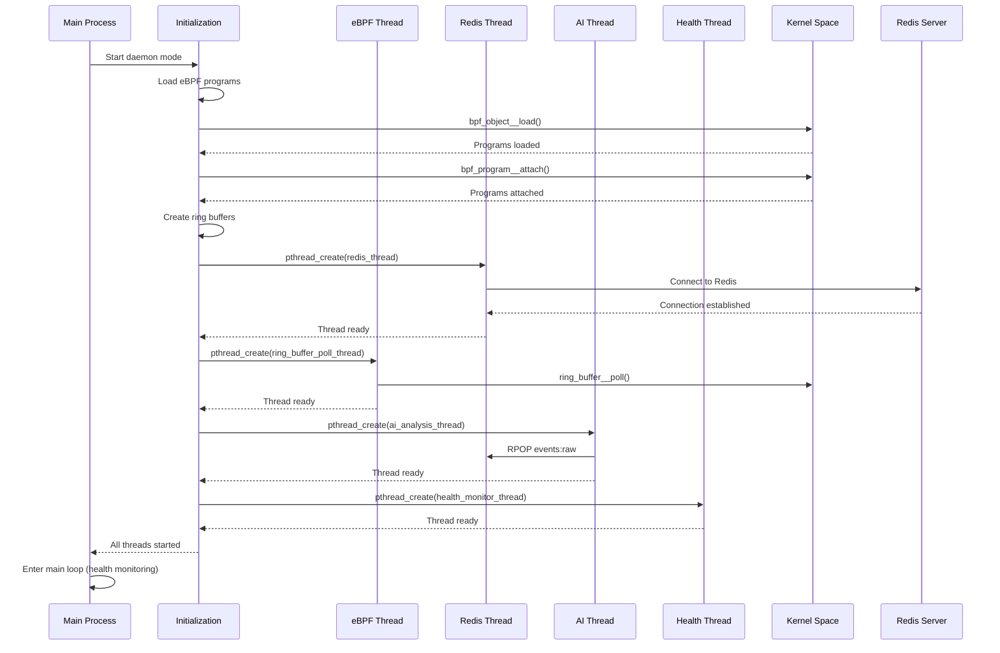
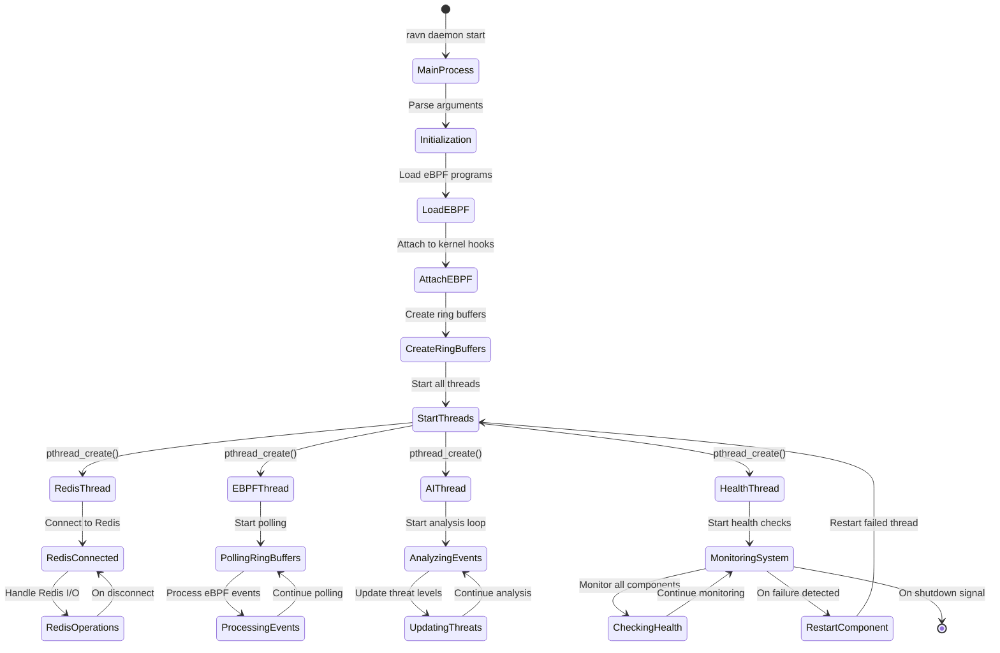

# RAVN Process Details - Thread Creation and Management

## Process Startup Sequence



## Thread Lifecycle Management



## Detailed Thread Functions

### Main Process Thread
```c
int main(int argc, char *argv[]) {
    // Parse arguments
    // Initialize components
    init_ebpf_handlers();    // Loads eBPF programs
    init_redis_client();     // Connects to Redis
    init_ai_engine();        // Loads AI model
    
    // Start all threads
    pthread_create(&ebpf_thread, NULL, ring_buffer_poll_thread, NULL);
    pthread_create(&redis_thread, NULL, redis_operations_thread, NULL);
    pthread_create(&ai_thread, NULL, ai_analysis_thread, NULL);
    pthread_create(&health_thread, NULL, health_monitor_thread, NULL);
    
    // Main health monitoring loop
    while (running) {
        monitor_system_health();
        sleep(1);
    }
    
    // Cleanup
    cleanup_ebpf_handlers();
    cleanup_redis_client();
    cleanup_ai_engine();
}
```

### eBPF Handler Thread
```c
void* ring_buffer_poll_thread(void* arg) {
    while (running) {
        // Poll all ring buffers
        ring_buffer__poll(syscall_rb, 100);    // 100ms timeout
        ring_buffer__poll(network_rb, 100);
        ring_buffer__poll(security_rb, 100);
        ring_buffer__poll(file_rb, 100);
    }
    return NULL;
}
```

### Redis Client Thread
```c
void* redis_operations_thread(void* arg) {
    while (running) {
        // Handle Redis operations
        if (events_to_send) {
            redisCommand(redis_ctx, "LPUSH events:raw %s", event_json);
        }
        
        if (ai_needs_events) {
            redisReply* reply = redisCommand(redis_ctx, "RPOP events:raw");
            // Process reply
        }
        
        usleep(1000); // 1ms sleep
    }
    return NULL;
}
```

### AI Analysis Thread
```c
void* ai_analysis_thread(void* arg) {
    while (running) {
        // Read events from Redis
        redisReply* reply = redisCommand(redis_ctx, "RPOP events:raw");
        
        if (reply && reply->str) {
            // Analyze event sequence
            float threat_score = analyze_event_sequence(reply->str);
            
            // Update threat level
            char threat_level[32];
            if (threat_score > 80) strcpy(threat_level, "HIGH");
            else if (threat_score > 50) strcpy(threat_level, "MEDIUM");
            else strcpy(threat_level, "LOW");
            
            // Publish to Redis
            redisCommand(redis_ctx, "SET threat_level %s", threat_level);
            redisCommand(redis_ctx, "PUBLISH threat_updates %s", threat_level);
        }
        
        sleep(1); // 1 second interval
    }
    return NULL;
}
```

### Health Monitoring Thread
```c
void* health_monitor_thread(void* arg) {
    while (running) {
        // Check eBPF programs
        if (!check_ebpf_programs_loaded()) {
            LOG_ERROR("eBPF programs not loaded, restarting...");
            restart_ebpf_handlers();
        }
        
        // Check Redis connection
        if (!check_redis_connection()) {
            LOG_ERROR("Redis disconnected, reconnecting...");
            reconnect_redis();
        }
        
        // Check thread health
        check_thread_health();
        
        // Log system metrics
        log_system_metrics();
        
        sleep(5); // 5 second interval
    }
    return NULL;
}
```

## Thread Synchronization

### Global Variables
```c
// Thread control
static volatile int running = 1;
static pthread_t ebpf_thread;
static pthread_t redis_thread;
static pthread_t ai_thread;
static pthread_t health_thread;

// Thread status
static int ebpf_thread_healthy = 0;
static int redis_thread_healthy = 0;
static int ai_thread_healthy = 0;
static int health_thread_healthy = 0;

// Shared data
static struct ravn_event event_queue[MAX_EVENTS];
static int event_queue_count = 0;
static pthread_mutex_t event_queue_mutex = PTHREAD_MUTEX_INITIALIZER;
```

### Signal Handling
```c
void signal_handler(int sig) {
    if (sig == SIGINT || sig == SIGTERM) {
        LOG_INFO("Received shutdown signal, stopping threads...");
        running = 0;
        
        // Wait for threads to finish
        pthread_join(ebpf_thread, NULL);
        pthread_join(redis_thread, NULL);
        pthread_join(ai_thread, NULL);
        pthread_join(health_thread, NULL);
        
        exit(0);
    }
}
```

## Performance Metrics

| Component | Frequency | Latency | Throughput |
|-----------|-----------|---------|------------|
| eBPF Polling | Continuous | <1ms | 10K+ events/sec |
| Redis Operations | As needed | 1-5ms | 1K+ ops/sec |
| AI Analysis | 1 second | 50-100ms | 1 analysis/sec |
| Health Monitoring | 5 seconds | 10-20ms | 1 check/5sec |

## Error Recovery

1. **eBPF Program Failure**: Health monitor detects and reloads programs
2. **Redis Disconnection**: Automatic reconnection with exponential backoff
3. **AI Model Error**: Fallback to rule-based analysis
4. **Thread Crash**: Health monitor restarts failed threads
5. **Memory Issues**: Health monitor logs and alerts on memory usage
