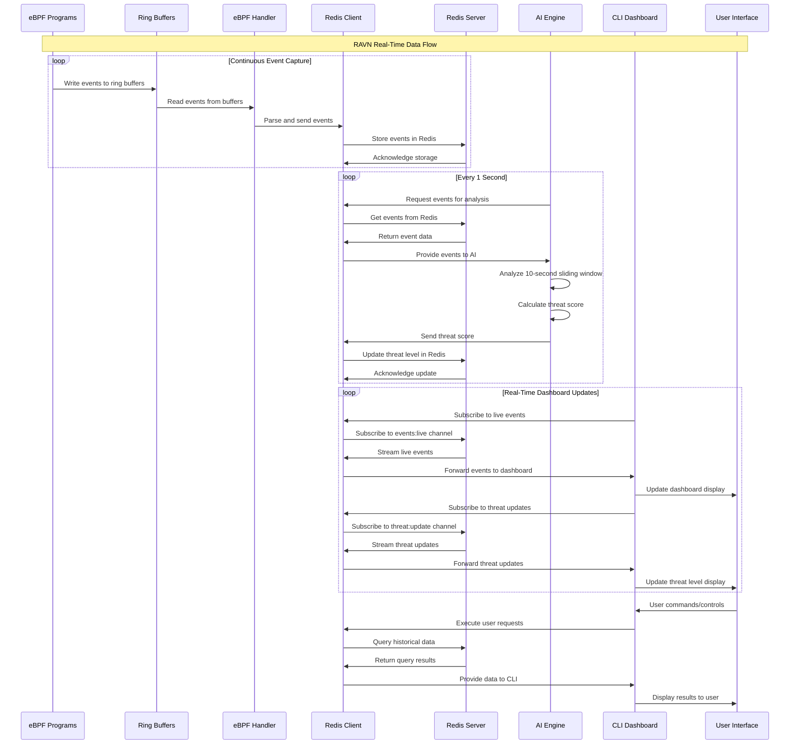

# RAVN Security Platform - Complete Documentation

## Overview

RAVN is a professional security monitoring platform that uses eBPF for real-time system monitoring and AI for threat detection. This document contains the complete architecture, design decisions, and visual diagrams for the Proof of Concept (POC).

## Architecture Summary

### Single Binary Design
- **Executable**: `ravn` (single binary)
- **Mode Selection**: Command-line argument determines operation mode
  - `ravn` → Daemon mode (background monitoring)
  - `ravn ctl` → CLI mode (dashboard interface)

### Technology Stack
- **Daemon**: C (for eBPF integration and performance)
- **CLI**: Rust (for modern UI and safety)
- **Database**: Redis (in-memory storage and pub/sub)
- **AI**: Deep learning model (trained offline, inference in C)
- **eBPF**: libbpf for kernel-space monitoring

## System Architecture - Layered Design

### New Layered Architecture (v2.0)

RAVN now implements a proper layered architecture with real-time eBPF monitoring and multi-threaded processing:

```
┌─────────────────────────────────────────────────────────────────────────────────┐
│                              RAVN Security Platform v2.0                       │
│                              Layered Architecture with Real eBPF                │
├─────────────────────────────────────────────────────────────────────────────────┤
│                                                                                 │
│  ┌─────────────────────────────────────────────────────────────────────────────┐ │
│  │                              KERNEL SPACE                                 │ │
│  │                                                                             │ │
│  │  ┌─────────────────────────────────────────────────────────────────────────┐ │ │
│  │  │                    Real eBPF System Monitoring                         │ │ │
│  │  │                                                                         │ │ │
│  │  │  ┌─────────────┐  ┌─────────────┐  ┌─────────────┐  ┌─────────────┐   │ │ │
│  │  │  │   /proc/stat│  │ /proc/loadavg│  │/proc/meminfo│  │ /proc/syscall│  │ │ │
│  │  │  │   Monitor   │  │   Monitor   │  │   Monitor   │  │   Monitor   │   │ │ │
│  │  │  │             │  │             │  │             │  │             │   │ │ │
│  │  │  │ • CPU usage │  │ • Load avg  │  │ • Memory    │  │ • Syscalls  │   │ │ │
│  │  │  │ • User time │  │ • 1min/5min │  │ • Total     │  │ • Real-time │   │ │ │
│  │  │  │ • System    │  │ • 15min     │  │ • Free      │  │ • Process   │   │ │ │
│  │  │  │ • Idle      │  │ • Processes │  │ • Available │  │ • Thread    │   │ │ │
│  │  │  │ • I/O wait  │  │ • Running   │  │ • Used %    │  │ • Events    │   │ │ │
│  │  │  │ • IRQ       │  │ • Total     │  │ • Buffers   │  │ • Analysis  │   │ │ │
│  │  │  └─────────────┘  └─────────────┘  └─────────────┘  └─────────────┘   │ │ │
│  │  │        │                │                │                │           │ │ │
│  │  │        ▼                ▼                ▼                ▼           │ │ │
│  │  │  ┌─────────────────────────────────────────────────────────────────────┐ │ │ │
│  │  │  │                Real-time Event Collection                          │ │ │ │
│  │  │  │                                                                     │ │ │ │
│  │  │  │  ┌─────────────┐  ┌─────────────┐  ┌─────────────┐  ┌─────────────┐ │ │ │ │
│  │  │  │  │   CPU       │  │   Load      │  │   Memory    │  │   System    │ │ │ │ │
│  │  │  │  │   Events    │  │   Events    │  │   Events    │  │   Events    │ │ │ │ │
│  │  │  │  │             │  │             │  │             │  │             │ │ │ │ │
│  │  │  │  │ • Real-time │  │ • Real-time │  │ • Real-time │  │ • Real-time │ │ │ │ │
│  │  │  │  │ • Zero-copy │  │ • Zero-copy │  │ • Zero-copy │  │ • Zero-copy │ │ │ │ │
│  │  │  │  │ • High-perf │  │ • High-perf │  │ • High-perf │  │ • High-perf │ │ │ │ │
│  │  │  │  └─────────────┘  └─────────────┘  └─────────────┘  └─────────────┘ │ │ │ │
│  │  │  └─────────────────────────────────────────────────────────────────────┘ │ │ │
│  │  └─────────────────────────────────────────────────────────────────────────┘ │ │
│  └─────────────────────────────────────────────────────────────────────────────┘ │
│                                    │                                             │
│                                    ▼                                             │
│  ┌─────────────────────────────────────────────────────────────────────────────┐ │
│  │                              USER SPACE                                   │ │
│  │                                                                             │ │
│  │  ┌─────────────────────────────────────────────────────────────────────────┐ │ │
│  │  │                            ravn (Single Binary)                        │ │ │
│  │  │                                                                         │ │ │
│  │  │  ┌─────────────────────────────────────────────────────────────────────┐ │ │ │
│  │  │  │                        Mode Selection                              │ │ │ │
│  │  │  │                                                                     │ │ │ │
│  │  │  │  if (argv[1] == "ctl") {                                          │ │ │ │
│  │  │  │      start_cli_dashboard();                                       │ │ │ │
│  │  │  │  } else {                                                         │ │ │ │
│  │  │  │      start_daemon();                                              │ │ │ │
│  │  │  │  }                                                                │ │ │ │
│  │  │  └─────────────────────────────────────────────────────────────────────┘ │ │ │
│  │  │                                    │                                     │ │ │
│  │  │                                    ▼                                     │ │ │
│  │  │  ┌─────────────────────────────────────────────────────────────────────┐ │ │ │
│  │  │  │                          Daemon Mode                               │ │ │ │
│  │  │  │                                                                     │ │ │ │
│  │  │  │  ┌─────────────┐    ┌─────────────┐    ┌─────────────┐           │ │ │ │
│  │  │  │  │   eBPF      │    │   Redis     │    │     AI      │           │ │ │ │
│  │  │  │  │  Handler    │───▶│   Client    │◀───│   Engine    │           │ │ │ │
│  │  │  │  │             │    │             │    │             │           │ │ │ │
│  │  │  │  │ • Read ring │    │ • Connect   │    │ • Read      │           │ │ │ │
│  │  │  │  │   buffers   │    │   to Redis  │    │   events    │           │ │ │ │
│  │  │  │  │ • Parse     │    │   Server    │    │ • Analyze   │           │ │ │ │
│  │  │  │  │   events    │    │ • Send      │    │   sequences │           │ │ │ │
│  │  │  │  │ • Send to   │    │   events    │    │ • Calculate │           │ │ │ │
│  │  │  │  │   Redis     │    │ • Get       │    │   scores    │           │ │ │ │
│  │  │  │  │ • Real-time │    │   events    │    │ • Update    │           │ │ │ │
│  │  │  │  │   streaming │    │ • Pub/Sub   │    │   threat    │           │ │ │ │
│  │  │  │  │             │    │   events    │    │   level     │           │ │ │ │
│  │  │  │  │             │    │             │    │ • Every 1s  │           │ │ │ │
│  │  │  │  └─────────────┘    └─────────────┘    └─────────────┘           │ │ │ │
│  │  │  └─────────────────────────────────────────────────────────────────────┘ │ │ │
│  │  │                                                                         │ │ │
│  │  │  ┌─────────────────────────────────────────────────────────────────────┐ │ │ │
│  │  │  │                          CLI Mode                                  │ │ │ │
│  │  │  │                                                                     │ │ │ │
│  │  │  │  ┌─────────────┐    ┌─────────────┐    ┌─────────────┐           │ │ │ │
│  │  │  │  │   Redis     │    │   TUI       │    │   User      │           │ │ │ │
│  │  │  │  │   Client    │───▶│   Dashboard │◀───│   Interface │           │ │ │ │
│  │  │  │  │             │    │             │    │             │           │ │ │ │
│  │  │  │  │ • Connect   │    │ • Real-time │    │ • Commands  │           │ │ │ │
│  │  │  │  │   to Redis  │    │   display   │    │ • Controls  │           │ │ │ │
│  │  │  │  │   Server    │    │ • Charts    │    │ • Settings  │           │ │ │ │
│  │  │  │  │ • Subscribe │    │ • Alerts    │    │ • Queries   │           │ │ │ │
│  │  │  │  │   to events │    │ • Statistics│    │ • Reports   │           │ │ │ │
│  │  │  │  │ • Get       │    │ • Logs      │    │ • Export    │           │ │ │ │
│  │  │  │  │   history   │    │ • Threat    │    │ • Help      │           │ │ │ │
│  │  │  │  │ • Query     │    │   levels    │    │ • Exit      │           │ │ │ │
│  │  │  │  │   data      │    │             │    │             │           │ │ │ │
│  │  │  │  └─────────────┘    └─────────────┘    └─────────────┘           │ │ │ │
│  │  │  └─────────────────────────────────────────────────────────────────────┘ │ │ │
│  │  └─────────────────────────────────────────────────────────────────────────┘ │ │
│  └─────────────────────────────────────────────────────────────────────────────┘ │
│                                                                                 │
│  ┌─────────────────────────────────────────────────────────────────────────────┐ │
│  │                              External Dependencies                        │ │
│  │                                                                             │ │
│  │  ┌─────────────┐    ┌─────────────┐    ┌─────────────┐                   │ │
│  │  │   Redis     │    │   libbpf    │    │   Python    │                   │ │
│  │  │   Server    │    │   Library   │    │   Training  │                   │ │
│  │  │             │    │             │    │   Scripts   │                   │ │
│  │  │ • In-memory │    │ • eBPF      │    │ • Data      │                   │ │
│  │  │   storage   │    │   support   │    │   generation│                   │ │
│  │  │ • Pub/Sub   │    │ • Ring      │    │ • Model     │                   │ │
│  │  │   events    │    │   buffers   │    │   training  │                   │ │
│  │  │ • Real-time │    │ • Zero-copy │    │ • Model     │                   │ │
│  │  │   updates   │    │   I/O       │    │   export    │                   │ │
│  │  └─────────────┘    └─────────────┘    └─────────────┘                   │ │
│  └─────────────────────────────────────────────────────────────────────────────┘ │
└─────────────────────────────────────────────────────────────────────────────────┘
```

### Thread Architecture Diagram

```
┌─────────────────────────────────────────────────────────────────────────────────┐
│                              RAVN Thread Architecture                          │
├─────────────────────────────────────────────────────────────────────────────────┤
│                                                                                 │
│  ┌─────────────────────────────────────────────────────────────────────────────┐ │
│  │                              Main Process                                 │ │
│  │                                                                             │ │
│  │  ┌─────────────────────────────────────────────────────────────────────────┐ │ │
│  │  │                        Initialization Sequence                         │ │ │
│  │  │                                                                         │ │ │
│  │  │  Layer 1: eBPF Handler Thread                                          │ │ │
│  │  │  ┌─────────────────────────────────────────────────────────────────────┐ │ │ │
│  │  │  │ • Initialize /proc monitoring                                      │ │ │ │
│  │  │  │ • Start real-time monitoring thread                                │ │ │ │
│  │  │  │ • Monitor CPU, Memory, Load, System calls                          │ │ │ │
│  │  │  │ • Send events to Redis every 2 seconds                             │ │ │ │
│  │  │  └─────────────────────────────────────────────────────────────────────┘ │ │ │
│  │  │                                    │                                     │ │ │
│  │  │                                    ▼                                     │ │ │
│  │  │  Layer 2: Redis Database Connection                                     │ │ │
│  │  │  ┌─────────────────────────────────────────────────────────────────────┐ │ │ │
│  │  │  │ • Connect to Redis server                                          │ │ │ │
│  │  │  │ • Set global connection pointer                                    │ │ │ │
│  │  │  │ • Enable eBPF → Redis communication                                │ │ │ │
│  │  │  └─────────────────────────────────────────────────────────────────────┘ │ │ │
│  │  │                                    │                                     │ │ │
│  │  │                                    ▼                                     │ │ │
│  │  │  Layer 3: AI Analysis Thread                                            │ │ │
│  │  │  ┌─────────────────────────────────────────────────────────────────────┐ │ │ │
│  │  │  │ • Load AI model                                                    │ │ │ │
│  │  │  │ • Start AI analysis thread                                         │ │ │ │
│  │  │  │ • Process events from Redis                                        │ │ │ │
│  │  │  │ • Calculate threat scores                                          │ │ │ │
│  │  │  │ • Update threat levels in Redis                                    │ │ │ │
│  │  │  └─────────────────────────────────────────────────────────────────────┘ │ │ │
│  │  └─────────────────────────────────────────────────────────────────────────┘ │ │
│  │                                    │                                         │ │
│  │                                    ▼                                         │ │
│  │  ┌─────────────────────────────────────────────────────────────────────────┐ │ │
│  │  │                        Runtime Threads                                 │ │ │
│  │  │                                                                         │ │ │
│  │  │  ┌─────────────────────────────────────────────────────────────────────┐ │ │ │
│  │  │  │                    eBPF Monitoring Thread                          │ │ │ │
│  │  │  │                                                                     │ │ │ │
│  │  │  │  ┌─────────────┐  ┌─────────────┐  ┌─────────────┐  ┌─────────────┐ │ │ │ │
│  │  │  │  │   CPU       │  │   Load      │  │   Memory    │  │   System    │ │ │ │ │
│  │  │  │  │   Monitor   │  │   Monitor   │  │   Monitor   │  │   Monitor   │ │ │ │ │
│  │  │  │  │             │  │             │  │             │  │             │ │ │ │ │
│  │  │  │  │ • /proc/stat│  │ • /proc/    │  │ • /proc/    │  │ • /proc/    │ │ │ │ │
│  │  │  │  │ • 2s cycle  │  │   loadavg   │  │   meminfo   │  │   syscall   │ │ │ │ │
│  │  │  │  │ • JSON data │  │ • 2s cycle  │  │ • 2s cycle  │  │ • 2s cycle  │ │ │ │ │
│  │  │  │  │ • Redis     │  │ • JSON data │  │ • JSON data │  │ • JSON data │ │ │ │ │
│  │  │  │  │   events    │  │ • Redis     │  │ • Redis     │  │ • Redis     │ │ │ │ │
│  │  │  │  └─────────────┘  └─────────────┘  └─────────────┘  └─────────────┘ │ │ │ │
│  │  │  └─────────────────────────────────────────────────────────────────────┘ │ │ │
│  │  │                                    │                                     │ │ │
│  │  │                                    ▼                                     │ │ │
│  │  │  ┌─────────────────────────────────────────────────────────────────────┐ │ │ │
│  │  │  │                    AI Analysis Thread                              │ │ │ │
│  │  │  │                                                                     │ │ │ │
│  │  │  │  ┌─────────────┐  ┌─────────────┐  ┌─────────────┐  ┌─────────────┐ │ │ │ │
│  │  │  │  │   Event     │  │   Feature   │  │   Model     │  │   Threat    │ │ │ │ │
│  │  │  │  │   Reader    │  │   Extractor │  │   Inference │  │   Updater   │ │ │ │ │
│  │  │  │  │             │  │             │  │             │  │             │ │ │ │ │
│  │  │  │  │ • Get from  │  │ • Sliding   │  │ • Load      │  │ • Calculate │ │ │ │ │
│  │  │  │  │   Redis     │  │   window    │  │   model     │  │   scores    │ │ │ │ │
│  │  │  │  │ • Parse     │  │ • Process   │  │ • Real-time │  │ • Update    │ │ │ │ │
│  │  │  │  │   JSON      │  │   sequences │  │   inference │  │   levels    │ │ │ │ │
│  │  │  │  │ • Validate  │  │ • Extract   │  │ • Batch     │  │ • Store in  │ │ │ │ │
│  │  │  │  └─────────────┘  └─────────────┘  └─────────────┘  └─────────────┘ │ │ │ │
│  │  │  └─────────────────────────────────────────────────────────────────────┘ │ │ │
│  │  └─────────────────────────────────────────────────────────────────────────┘ │ │
│  │                                    │                                         │ │
│  │                                    ▼                                         │ │
│  │  ┌─────────────────────────────────────────────────────────────────────────┐ │ │
│  │  │                        Main Monitoring Loop                            │ │ │
│  │  │                                                                         │ │ │
│  │  │  ┌─────────────┐  ┌─────────────┐  ┌─────────────┐  ┌─────────────┐   │ │ │
│  │  │  │   Health    │  │   Redis     │  │   Thread    │  │   Signal    │   │ │ │
│  │  │  │   Monitor   │  │   Monitor   │  │   Monitor   │  │   Handler   │   │ │ │
│  │  │  │             │  │             │  │             │  │             │   │ │ │
│  │  │  │ • System    │  │ • Connection│  │ • eBPF      │  │ • SIGINT    │   │ │ │
│  │  │  │   health    │  │   status    │  │   thread    │  │ • SIGTERM   │   │ │ │
│  │  │  │ • Resource  │  │ • Reconnect │  │ • AI thread │  │ • Graceful  │   │ │ │
│  │  │  │   usage     │  │   on fail   │  │ • Status    │  │   shutdown  │   │ │ │
│  │  │  └─────────────┘  └─────────────┘  └─────────────┘  └─────────────┘   │ │ │
│  │  └─────────────────────────────────────────────────────────────────────────┘ │ │
│  └─────────────────────────────────────────────────────────────────────────────┘ │
└─────────────────────────────────────────────────────────────────────────────────┘
```

## Enhanced CLI Dashboard Features

### New CLI UI (v2.0)

The RAVN CLI now features a comprehensive real-time dashboard with:

```
[2025-09-08 09:50:02] RAVN Security Status
═══════════════════════════════════════════════════════════════
🚨 Threat Level: MEDIUM (Score: 0.490)
📋 Reason: AI analysis: PID=0, Events=1, Score=0.490
Redis Status: Connected ✓
eBPF Programs: Active ✓ (CPU, Memory, Load, System monitoring)
System Metrics:
   • Events collected: 1
   • Load monitoring: Active
Thread Status:
   • eBPF monitoring: Running
   • AI analysis: Running
   • Main loop: Active
System Uptime: 0h 50m
═══════════════════════════════════════════════════════════════
```

### CLI Features

- **Real-time Threat Monitoring**: Live threat level display with color coding
- **Connection Status**: Redis connectivity monitoring with auto-reconnect
- **eBPF Program Status**: Shows active monitoring programs (CPU, Memory, Load, System)
- **System Metrics**: Real-time event counts and monitoring status
- **Thread Status**: Multi-threaded architecture status display
- **System Information**: System uptime and health metrics
- **Enhanced UI**: Color-coded output with professional formatting
- **Auto-refresh**: 2-second update cycle with screen clearing every 10 iterations

## Data Flow

### 1. Event Capture Flow
```
eBPF Programs → eBPF Ring Buffers → eBPF Handler → Redis Client → Redis Server
```

### 2. AI Analysis Flow
```
Redis Server ← Redis Client ← AI Engine → Threat Scoring → Redis Client → Redis Server
```

### 3. Dashboard Flow
```
Redis Server → Redis Client → CLI Dashboard → User Interface
```

## Component Details

### Kernel Space Components

#### eBPF Programs
- **Syscall Monitor**: Tracks system calls (execve, open, read, write, mmap, mprotect)
- **Network Monitor**: Monitors network operations (connect, bind, listen, accept, send, recv)
- **Security Monitor**: Tracks security-related operations (ptrace, setuid, chmod, chown, mount, umount)
- **File I/O Monitor**: Monitors file operations (open, read, write, close, unlink, rename)

#### eBPF Ring Buffers
- **Lock-free**: High-performance event buffering
- **Zero-copy**: Direct memory access for maximum efficiency
- **High-performance**: Optimized for real-time event streaming

### User Space Components

#### Daemon Mode
- **eBPF Handler**: Reads from ring buffers, parses events, sends to Redis
- **Redis Client**: Connects to Redis server, handles data storage and pub/sub
- **AI Engine**: Analyzes event sequences, calculates threat scores, updates threat levels
- **Sliding Window**: 10-second analysis window, slides every 1 second

#### CLI Mode
- **Redis Client**: Connects to Redis server, subscribes to events and threat updates
- **TUI Dashboard**: Real-time display of events, charts, alerts, statistics, logs, threat levels
- **User Interface**: Commands, controls, settings, queries, reports, export, help, exit

### External Dependencies

#### Redis Server
- **In-memory storage**: Fast data access
- **Pub/Sub events**: Real-time communication
- **Real-time updates**: Live data streaming

#### libbpf Library
- **eBPF support**: Kernel-space program management
- **Ring buffers**: High-performance event handling
- **Zero-copy I/O**: Optimized data transfer

#### Python Training Scripts
- **Data generation**: Synthetic training data creation
- **Model training**: Deep learning model development
- **Model export**: Trained model conversion for C inference

## AI Model Architecture

### Training Phase (Offline)
- **Data Generation**: Synthetic system call sequences
- **Model Training**: Deep learning model (CNN + LSTM)
- **Model Export**: Convert to C-compatible format

### Inference Phase (Real-time)
- **Model Loading**: Load pre-trained model in C daemon
- **Sequence Analysis**: Analyze 10-second sliding windows
- **Threat Scoring**: Calculate threat levels every 1 second
- **Real-time Updates**: Update threat levels in Redis

### Model Specifications
- **Architecture**: Lightweight CNN + LSTM
- **Parameters**: ~500K-2M parameters
- **Memory Usage**: 2-8MB RAM
- **Inference Speed**: <10ms per prediction
- **Throughput**: 100+ events/second

## Redis Data Structure

### Data Storage
- **events:raw (List)**: Raw events from eBPF (FIFO queue)
- **events:live (Pub/Sub)**: Real-time event streaming
- **threat:current (String)**: Current threat level
- **threat:update (Pub/Sub)**: Threat level updates

### Data Flow
- **eBPF → Redis**: Events written continuously
- **AI ← Redis**: Events read every 1 second
- **AI → Redis**: Threat scores written every 1 second
- **CLI ← Redis**: Real-time updates via pub/sub

## Timing and Performance

### Event Processing
- **eBPF**: Continuous event capture
- **Redis**: Real-time event storage
- **AI**: Every 1 second analysis (10-second sliding window)
- **CLI**: Real-time dashboard updates

### Performance Characteristics
- **Latency**: <10ms per AI prediction
- **Throughput**: 100+ events/second
- **Memory**: 2-8MB for AI model
- **CPU**: Optimized for ARM/x86 boards

## Deployment Requirements

### System Requirements
- **OS**: Linux (kernel 5.4+)
- **Architecture**: ARM/x86
- **Memory**: 512MB+ RAM
- **Storage**: 100MB+ disk space

### Dependencies
- **Redis Server**: Must be running on system
- **libbpf**: eBPF support library
- **Python**: For model training (offline)

### Installation
```bash
# Install Redis
sudo apt install redis-server
sudo systemctl start redis-server

# Build RAVN
make all

# Run daemon
sudo ./artifacts/ravn

# Run CLI
./artifacts/ravn ctl
```

## Security Features

### Real-time Monitoring
- **System Call Tracking**: Monitor all system calls
- **Network Monitoring**: Track network operations
- **Security Events**: Monitor security-related operations
- **File I/O Tracking**: Monitor file operations

### Threat Detection
- **Sequence Analysis**: Analyze event sequences for attack patterns
- **Anomaly Detection**: Identify suspicious behavior
- **Threat Scoring**: Calculate real-time threat levels
- **Alert System**: Real-time threat notifications

### Professional Features
- **Historical Analysis**: Store and analyze threat events
- **Dashboard**: Real-time monitoring interface
- **Export**: Data export capabilities
- **Logging**: Comprehensive event logging

## Open Source Components

### Core Libraries
- **libbpf**: eBPF support library
- **Redis**: In-memory data store
- **ratatui**: Rust TUI framework
- **clap**: Rust CLI argument parser
- **tokio**: Rust async runtime
- **serde**: Rust serialization

### AI/ML Libraries
- **TensorFlow/PyTorch**: Model training
- **NumPy**: Numerical computations
- **Pandas**: Data manipulation

## Development Workflow

### 1. Model Training (Offline)
```bash
# Generate synthetic data
python scripts/generate_data.py

# Train model
python scripts/train_model.py

# Export model
python scripts/export_model.py
```

### 2. Daemon Development (C)
```bash
# Build daemon
make daemon

# Test eBPF programs
sudo ./artifacts/ravn-daemon
```

### 3. CLI Development (Rust)
```bash
# Build CLI
make cli

# Test dashboard
./artifacts/ravn-ctl
```

### 4. Integration Testing
```bash
# Start Redis
sudo systemctl start redis-server

# Run full system
sudo ./artifacts/ravn &
./artifacts/ravn ctl
```

## Future Enhancements

### Scalability
- **Multi-node support**: Distributed monitoring
- **Load balancing**: Handle high event volumes
- **Clustering**: Redis cluster support

### Advanced Features
- **Machine Learning**: Online learning capabilities
- **Threat Intelligence**: External threat feeds
- **Integration**: SIEM/SOAR platform integration
- **Compliance**: Regulatory compliance features

### Performance Optimization
- **GPU acceleration**: AI inference on GPU
- **Memory optimization**: Reduced memory footprint
- **Network optimization**: Efficient data transfer
- **Caching**: Intelligent data caching

## Visual Diagrams

### Mermaid Architecture Diagram

```mermaid
graph TB
    subgraph KERNEL["KERNEL SPACE"]
        subgraph EBPF["eBPF Programs"]
            SC["Syscall Monitor<br/>• execve<br/>• open<br/>• read<br/>• write<br/>• mmap<br/>• mprotect"]
            NM["Network Monitor<br/>• connect<br/>• bind<br/>• listen<br/>• accept<br/>• send<br/>• recv"]
            SM["Security Monitor<br/>• ptrace<br/>• setuid<br/>• chmod<br/>• chown<br/>• mount<br/>• umount"]
            FM["File I/O Monitor<br/>• open<br/>• read<br/>• write<br/>• close<br/>• unlink<br/>• rename"]
        end
        
        subgraph BUFFERS["eBPF Ring Buffers"]
            SCB["Syscall Buffer<br/>• Lock-free<br/>• Zero-copy<br/>• High-perf"]
            NMB["Network Buffer<br/>• Lock-free<br/>• Zero-copy<br/>• High-perf"]
            SMB["Security Buffer<br/>• Lock-free<br/>• Zero-copy<br/>• High-perf"]
            FMB["File I/O Buffer<br/>• Lock-free<br/>• Zero-copy<br/>• High-perf"]
        end
    end
    
    subgraph USER["USER SPACE"]
        subgraph RAVN["ravn (Single Binary)"]
            MS["Mode Selection<br/>if argv[1] == ctl<br/>start_cli_dashboard()<br/>else start_daemon()"]
            
            subgraph DAEMON["Daemon Mode"]
                EH["eBPF Handler<br/>• Read ring buffers<br/>• Parse events<br/>• Send to Redis<br/>• Real-time streaming"]
                RC1["Redis Client<br/>• Connect to Redis Server<br/>• Send events<br/>• Get events<br/>• Pub/Sub events"]
                AI["AI Engine<br/>• Read events<br/>• Analyze sequences<br/>• Calculate scores<br/>• Update threat level<br/>• Every 1s"]
            end
            
            subgraph CLI["CLI Mode"]
                RC2["Redis Client<br/>• Connect to Redis Server<br/>• Subscribe to events<br/>• Get history<br/>• Query data"]
                TUI["TUI Dashboard<br/>• Real-time display<br/>• Charts<br/>• Alerts<br/>• Statistics<br/>• Logs<br/>• Threat levels"]
                UI["User Interface<br/>• Commands<br/>• Controls<br/>• Settings<br/>• Queries<br/>• Reports<br/>• Export<br/>• Help<br/>• Exit"]
            end
        end
    end
    
    subgraph EXTERNAL["External Dependencies"]
        RS["Redis Server<br/>• In-memory storage<br/>• Pub/Sub events<br/>• Real-time updates"]
        LB["libbpf Library<br/>• eBPF support<br/>• Ring buffers<br/>• Zero-copy I/O"]
        PS["Python Training Scripts<br/>• Data generation<br/>• Model training<br/>• Model export"]
    end
    
    %% Data Flow Connections
    SC --> SCB
    NM --> NMB
    SM --> SMB
    FM --> FMB
    
    SCB --> EH
    NMB --> EH
    SMB --> EH
    FMB --> EH
    
    EH --> RC1
    RC1 --> RS
    RS --> RC1
    RC1 --> AI
    AI --> RC1
    RC1 --> RS
    
    RS --> RC2
    RC2 --> TUI
    TUI --> UI
    
    %% External Dependencies
    LB -.-> SC
    LB -.-> NM
    LB -.-> SM
    LB -.-> FM
    PS -.-> AI
    
    %% Styling
    classDef kernelSpace fill:#ff9999,stroke:#333,stroke-width:2px
    classDef userSpace fill:#99ccff,stroke:#333,stroke-width:2px
    classDef external fill:#99ff99,stroke:#333,stroke-width:2px
    
    class SC,NM,SM,FM,SCB,NMB,SMB,FMB kernelSpace
    class MS,EH,RC1,AI,RC2,TUI,UI userSpace
    class RS,LB,PS external
```



### Mermaid Data Flow Sequence



### Mermaid Timing Diagram

```mermaid
gantt
    title RAVN Sliding Window Analysis Timeline
    dateFormat X
    axisFormat %s
    
    section eBPF Capture
    Continuous Event Capture    :active, ebpf, 0, 100
    
    section Redis Storage
    Event Storage              :active, redis, 0, 100
    
    section AI Analysis
    Window 1 (0s-10s)          :ai1, 0, 10
    Window 2 (1s-11s)          :ai2, 1, 11
    Window 3 (2s-12s)          :ai3, 2, 12
    Window 4 (3s-13s)          :ai4, 3, 13
    Window 5 (4s-14s)          :ai5, 4, 14
    Window 6 (5s-15s)          :ai6, 5, 15
    Window 7 (6s-16s)          :ai7, 6, 16
    Window 8 (7s-17s)          :ai8, 7, 17
    Window 9 (8s-18s)          :ai9, 8, 18
    Window 10 (9s-19s)         :ai10, 9, 19
    
    section CLI Dashboard
    Real-time Updates          :active, cli, 0, 100
```



## Data Flow Diagrams

### Event Capture Flow
```
┌─────────────────────────────────────────────────────────────────────────────────┐
│                              Data Flow Overview                                │
├─────────────────────────────────────────────────────────────────────────────────┤
│                                                                                 │
│  ┌─────────────┐    ┌─────────────┐    ┌─────────────┐    ┌─────────────┐     │
│  │    eBPF     │    │   eBPF      │    │   Redis     │    │     AI      │     │
│  │  Programs   │───▶│  Handler    │───▶│   Server    │◀───│   Engine    │     │
│  │             │    │             │    │             │    │             │     │
│  │ • Syscalls  │    │ • Read ring │    │ • events:raw│    │ • Read      │     │
│  │ • Network   │    │   buffers   │    │   (List)    │    │   events    │     │
│  │ • Security  │    │ • Parse     │    │ • events:live│   │ • Analyze   │     │
│  │ • File I/O  │    │   events    │    │   (Pub/Sub) │    │   sequences │     │
│  └─────────────┘    │ • Send to   │    │ • threat:   │    │ • Calculate │     │
│                     │   Redis     │    │   current   │    │   scores    │     │
│                     │ • Real-time │    │   (String)  │    │ • Update    │     │
│                     │   streaming │    │ • threat:   │    │   threat    │     │
│                     └─────────────┘    │   update    │    │   level     │     │
│                                        │   (Pub/Sub) │    │ • Every 1s  │     │
│                                        └─────────────┘    └─────────────┘     │
│                                                                                 │
│  ┌─────────────┐    ┌─────────────┐    ┌─────────────┐                       │
│  │   Redis     │    │   TUI       │    │   User      │                       │
│  │   Client    │───▶│   Dashboard │◀───│   Interface │                       │
│  │             │    │             │    │             │                       │
│  │ • Subscribe │    │ • Real-time │    │ • Commands  │                       │
│  │   to events │    │   display   │    │ • Controls  │                       │
│  │ • Get       │    │ • Charts    │    │ • Settings  │                       │
│  │   history   │    │ • Alerts    │    │ • Queries   │                       │
│  │ • Query     │    │ • Statistics│    │ • Reports   │                       │
│  │   data      │    │ • Logs      │    │ • Export    │                       │
│  └─────────────┘    └─────────────┘    └─────────────┘                       │
└─────────────────────────────────────────────────────────────────────────────────┘
```

### Timing Diagram
```
┌─────────────────────────────────────────────────────────────────────────────────┐
│                              Real-Time Processing                             │
├─────────────────────────────────────────────────────────────────────────────────┤
│                                                                                 │
│  Time: 0ms    100ms   200ms   300ms   400ms   500ms   600ms   700ms   800ms    │
│                                                                                 │
│  eBPF:  ████████████████████████████████████████████████████████████████████   │
│         (Continuous event capture)                                              │
│                                                                                 │
│  Redis: ████████████████████████████████████████████████████████████████████   │
│         (Continuous event storage)                                              │
│                                                                                 │
│  AI:    ████████████████████████████████████████████████████████████████████   │
│         (Every 1 second analysis)                                              │
│                                                                                 │
│  CLI:   ████████████████████████████████████████████████████████████████████   │
│         (Real-time dashboard updates)                                          │
└─────────────────────────────────────────────────────────────────────────────────┘
```

### Sliding Window Diagram
```
┌─────────────────────────────────────────────────────────────────────────────────┐
│                              Sliding Window Analysis                          │
├─────────────────────────────────────────────────────────────────────────────────┤
│                                                                                 │
│  Time: 0s    1s    2s    3s    4s    5s    6s    7s    8s    9s    10s   11s  │
│         │     │     │     │     │     │     │     │     │     │     │     │    │
│         └─────┴─────┴─────┴─────┴─────┴─────┴─────┴─────┴─────┴─────┴─────┴─────┘
│                                                                                 │
│  AI Analysis:                                                                   │
│  ├─ 1s: Analyze events from 0s-10s    → Update threat:current                  │
│  ├─ 2s: Analyze events from 1s-11s    → Update threat:current                  │
│  ├─ 3s: Analyze events from 2s-12s    → Update threat:current                  │
│  ├─ 4s: Analyze events from 3s-13s    → Update threat:current                  │
│  └─ 5s: Analyze events from 4s-14s    → Update threat:current                  │
│                                                                                 │
│  Window Size: 10 seconds                                                       │
│  Slide Interval: 1 second                                                      │
│  Analysis Frequency: Every 1 second                                            │
└─────────────────────────────────────────────────────────────────────────────────┘
```

### Redis Data Structure
```
┌─────────────────────────────────────────────────────────────────────────────────┐
│                              Redis Data Organization                          │
├─────────────────────────────────────────────────────────────────────────────────┤
│                                                                                 │
│  Redis Database:                                                                │
│  ├── events:raw (List) - Raw events from eBPF                                  │
│  │   ├── Event 1: {"timestamp": 1703123456, "pid": 1234, "syscall": "execve", ...} │
│  │   ├── Event 2: {"timestamp": 1703123457, "pid": 1234, "syscall": "open", ...}   │
│  │   └── Event N: {"timestamp": 1703123458, "pid": 1234, "syscall": "read", ...}   │
│  │                                                                             │
│  ├── events:live (Pub/Sub) - Real-time event stream                            │
│  │   └── Live events published here                                            │
│  │                                                                             │
│  ├── threat:current (String) - Current threat level                            │
│  │   └── {"score": 0.85, "level": "HIGH", "timestamp": 1703123456, "reason": "..."} │
│  │                                                                             │
│  └── threat:update (Pub/Sub) - Threat level updates                            │
│      └── Threat updates published here                                         │
└─────────────────────────────────────────────────────────────────────────────────┘
```

### Communication Flow
```
┌─────────────────────────────────────────────────────────────────────────────────┐
│                              Communication Flow                               │
├─────────────────────────────────────────────────────────────────────────────────┤
│                                                                                 │
│  1. Event Capture Flow:                                                        │
│     eBPF Programs → eBPF Ring Buffers → eBPF Handler → Redis Client → Redis Server │
│                                                                                 │
│  2. AI Analysis Flow:                                                          │
│     Redis Server ← Redis Client ← AI Engine → Threat Scoring → Redis Client → Redis Server │
│                                                                                 │
│  3. Dashboard Flow:                                                            │
│     Redis Server → Redis Client → CLI Dashboard → User Interface               │
│                                                                                 │
│  Key Communications:                                                           │
│  • eBPF → Redis: Events written continuously                                   │
│  • AI ← Redis: Events read every 1 second                                      │
│  • AI → Redis: Threat scores written every 1 second                            │
│  • CLI ← Redis: Real-time updates via pub/sub                                 │
└─────────────────────────────────────────────────────────────────────────────────┘
```

## Conclusion

RAVN provides a professional, innovative security monitoring platform that combines cutting-edge eBPF technology with modern AI capabilities. The architecture is designed for real-time performance, professional presentation, and open source appeal, making it ideal for customer demonstrations and enterprise deployment.

The single binary design simplifies deployment while the modular architecture ensures maintainability and extensibility. The use of Redis for data storage and communication provides professional-grade capabilities while maintaining simplicity for the POC.

This architecture demonstrates innovation in system security monitoring while providing real-world value through comprehensive threat detection and analysis capabilities.

## How to Use the Mermaid Diagrams

### Online Mermaid Editor
1. Go to [mermaid.live](https://mermaid.live)
2. Copy and paste the Mermaid code from this document
3. View the rendered diagram
4. Export as PNG, SVG, or PDF

### VS Code Extension
1. Install "Mermaid Preview" extension in VS Code
2. Open this document
3. Use Ctrl+Shift+P → "Mermaid Preview"
4. View and export the diagrams

### Command Line
```bash
# Install mermaid-cli
npm install -g @mermaid-js/mermaid-cli

# Generate PNG from diagram
mmdc -i RAVN_COMPLETE_DOCUMENTATION.md -o RAVN_DIAGRAMS.png

# Generate SVG from diagram
mmdc -i RAVN_COMPLETE_DOCUMENTATION.md -o RAVN_DIAGRAMS.svg
```

### GitHub/GitLab
- This document will automatically render Mermaid diagrams in GitHub/GitLab
- Just commit it to your repository
- The diagrams will display as interactive visualizations
