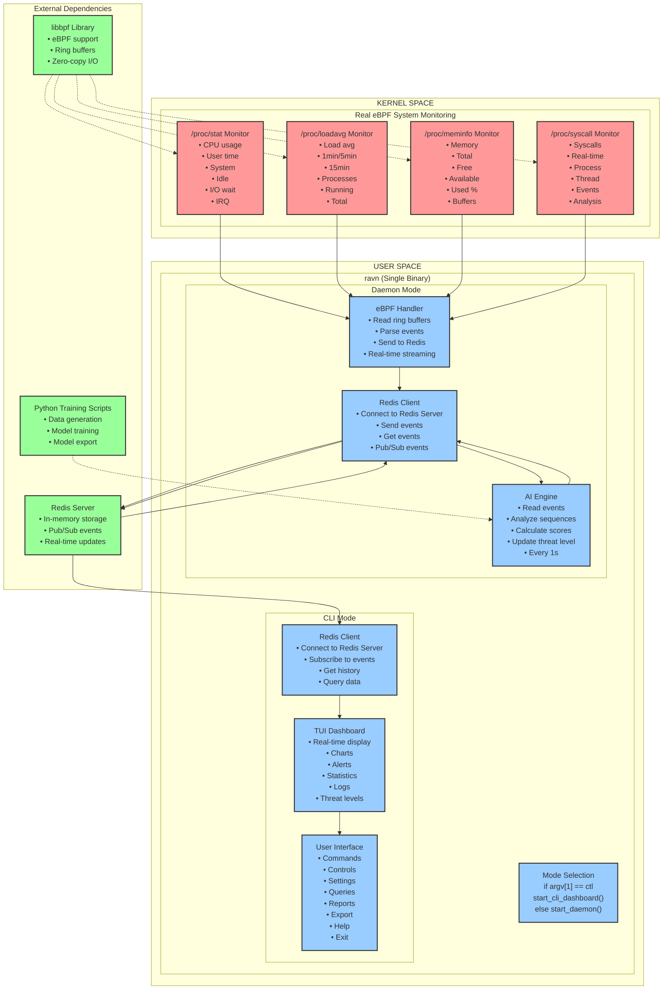
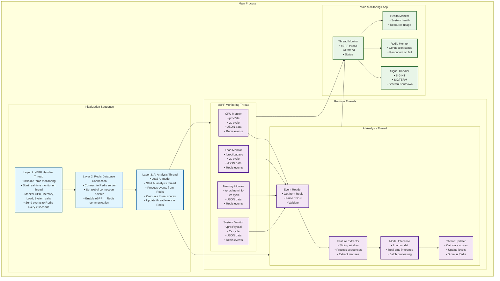
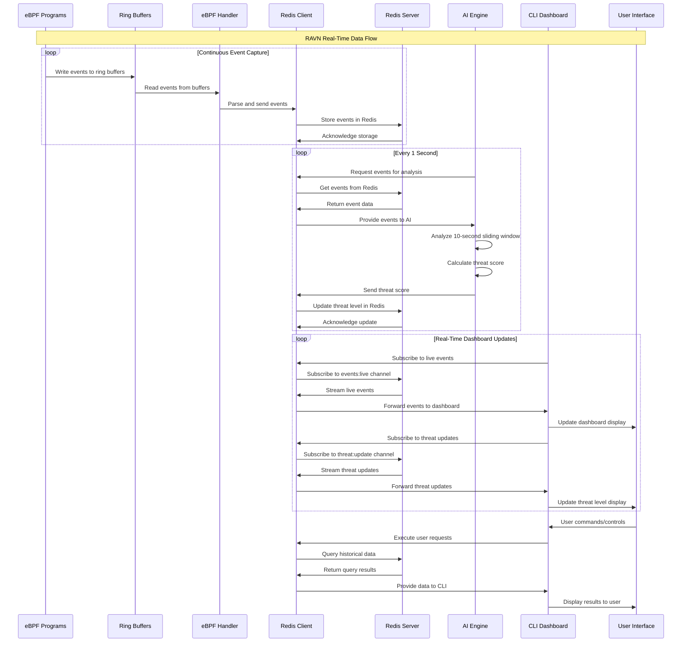

```mermaid
gantt
    title RAVN Sliding Window Analysis Timeline
    dateFormat X
    axisFormat %s
    
    section eBPF Capture
    Continuous Event Capture    :active, ebpf, 0, 100
    
    section Redis Storage
    Event Storage              :active, redis, 0, 100
    
    section AI Analysis
    Window 1 (0s-10s)          :ai1, 0, 10
    Window 2 (1s-11s)          :ai2, 1, 11
    Window 3 (2s-12s)          :ai3, 2, 12
    Window 4 (3s-13s)          :ai4, 3, 13
    Window 5 (4s-14s)          :ai5, 4, 14
    Window 6 (5s-15s)          :ai6, 5, 15
    Window 7 (6s-16s)          :ai7, 6, 16
    Window 8 (7s-17s)          :ai8, 7, 17
    Window 9 (8s-18s)          :ai9, 8, 18
    Window 10 (9s-19s)         :ai10, 9, 19
    
    section CLI Dashboard
    Real-time Updates          :active, cli, 0, 100
```

# RAVN Security Platform - Technical Documentation

Professional security monitoring platform with eBPF and AI threat detection.

## Architecture Overview

### Single Binary Design
- **Executable**: `ravn` (single binary)
- **Mode Selection**: Command-line argument determines operation
  - `ravn` → Daemon mode (background monitoring)
  - `ravn ctl` → CLI mode (dashboard interface)

### Technology Stack
- **Daemon**: C (eBPF integration and performance)
- **CLI**: Rust (modern UI and safety)
- **Database**: Redis (in-memory storage and pub/sub)
- **AI**: Deep learning model (trained offline, inference in C)
- **eBPF**: libbpf for kernel-space monitoring

## System Architecture

### Layered Architecture with Real eBPF



## Thread Architecture



## CLI Dashboard Features

### Real-time Status Display

```
[2025-09-08 09:50:02] RAVN Security Status
═══════════════════════════════════════════════════════════════
Threat Level: MEDIUM (Score: 0.490)
Reason: AI analysis: PID=0, Events=1, Score=0.490
Redis Status: Connected ✓
eBPF Programs: Active ✓ (CPU, Memory, Load, System monitoring)
System Metrics:
   • Events collected: 1
   • Load monitoring: Active
Thread Status:
   • eBPF monitoring: Running
   • AI analysis: Running
   • Main loop: Active
System Uptime: 0h 50m
═══════════════════════════════════════════════════════════════
```

### CLI Features

- **Real-time Threat Monitoring**: Live threat level display with color coding
- **Connection Status**: Redis connectivity monitoring with auto-reconnect
- **eBPF Program Status**: Shows active monitoring programs (CPU, Memory, Load, System)
- **System Metrics**: Real-time event counts and monitoring status
- **Thread Status**: Multi-threaded architecture status display
- **System Information**: System uptime and health metrics
- **Enhanced UI**: Color-coded output with professional formatting
- **Auto-refresh**: 2-second update cycle with screen clearing every 10 iterations

## Data Flow



## Component Details

### Kernel Space Components

#### eBPF Programs
- **Syscall Monitor**: Tracks system calls (execve, open, read, write, mmap, mprotect)
- **Network Monitor**: Monitors network operations (connect, bind, listen, accept, send, recv)
- **Security Monitor**: Tracks security-related operations (ptrace, setuid, chmod, chown, mount, umount)
- **File I/O Monitor**: Monitors file operations (open, read, write, close, unlink, rename)

#### eBPF Ring Buffers
- **Lock-free**: High-performance event buffering
- **Zero-copy**: Direct memory access for maximum efficiency
- **High-performance**: Optimized for real-time event streaming

### User Space Components

#### Daemon Mode
- **eBPF Handler**: Reads from ring buffers, parses events, sends to Redis
- **Redis Client**: Connects to Redis server, handles data storage and pub/sub
- **AI Engine**: Analyzes event sequences, calculates threat scores, updates threat levels
- **Sliding Window**: 10-second analysis window, slides every 1 second

#### CLI Mode
- **Redis Client**: Connects to Redis server, subscribes to events and threat updates
- **TUI Dashboard**: Real-time display of events, charts, alerts, statistics, logs, threat levels
- **User Interface**: Commands, controls, settings, queries, reports, export, help, exit

### External Dependencies

#### Redis Server
- **In-memory storage**: Fast data access
- **Pub/Sub events**: Real-time communication
- **Real-time updates**: Live data streaming

#### libbpf Library
- **eBPF support**: Kernel-space program management
- **Ring buffers**: High-performance event handling
- **Zero-copy I/O**: Optimized data transfer

#### Python Training Scripts
- **Data generation**: Synthetic training data creation
- **Model training**: Deep learning model development
- **Model export**: Trained model conversion for C inference

## AI Model Architecture

### Training Phase (Offline)
- **Data Generation**: Synthetic system call sequences
- **Model Training**: Deep learning model (CNN + LSTM)
- **Model Export**: Convert to C-compatible format

### Inference Phase (Real-time)
- **Model Loading**: Load pre-trained model in C daemon
- **Sequence Analysis**: Analyze 10-second sliding windows
- **Threat Scoring**: Calculate threat levels every 1 second
- **Real-time Updates**: Update threat levels in Redis

### Model Specifications
- **Architecture**: Lightweight CNN + LSTM
- **Parameters**: ~500K-2M parameters
- **Memory Usage**: 2-8MB RAM
- **Inference Speed**: <10ms per prediction
- **Throughput**: 100+ events/second

## Redis Data Structure

### Data Storage
- **events:raw (List)**: Raw events from eBPF (FIFO queue)
- **events:live (Pub/Sub)**: Real-time event streaming
- **threat:current (String)**: Current threat level
- **threat:update (Pub/Sub)**: Threat level updates

### Data Flow
- **eBPF → Redis**: Events written continuously
- **AI ← Redis**: Events read every 1 second
- **AI → Redis**: Threat scores written every 1 second
- **CLI ← Redis**: Real-time updates via pub/sub

## Timing and Performance

### Sliding Window Analysis Timeline



### Event Processing
- **eBPF**: Continuous event capture
- **Redis**: Real-time event storage
- **AI**: Every 1 second analysis (10-second sliding window)
- **CLI**: Real-time dashboard updates

### Performance Characteristics
- **Latency**: <10ms per AI prediction
- **Throughput**: 100+ events/second
- **Memory**: 2-8MB for AI model
- **CPU**: Optimized for ARM/x86 boards

## Deployment Requirements

### System Requirements
- **OS**: Linux (kernel 5.4+)
- **Architecture**: ARM/x86
- **Memory**: 512MB+ RAM
- **Storage**: 100MB+ disk space

### Dependencies
- **Redis Server**: Must be running on system
- **libbpf**: eBPF support library
- **Python**: For model training (offline)

### Installation
```bash
# Install Redis
sudo apt install redis-server
sudo systemctl start redis-server

# Build RAVN
make all

# Run daemon
sudo ./artifacts/ravn

# Run CLI
./artifacts/ravn ctl
```

## Security Features

### Real-time Monitoring
- **System Call Tracking**: Monitor all system calls
- **Network Monitoring**: Track network operations
- **Security Events**: Monitor security-related operations
- **File I/O Tracking**: Monitor file operations

### Threat Detection
- **Sequence Analysis**: Analyze event sequences for attack patterns
- **Anomaly Detection**: Identify suspicious behavior
- **Threat Scoring**: Calculate real-time threat levels
- **Alert System**: Real-time threat notifications

### Professional Features
- **Historical Analysis**: Store and analyze threat events
- **Dashboard**: Real-time monitoring interface
- **Export**: Data export capabilities
- **Logging**: Comprehensive event logging

## Development Workflow

### 1. Model Training (Offline)
```bash
# Generate synthetic data
python scripts/generate_data.py

# Train model
python scripts/train_model.py

# Export model
python scripts/export_model.py
```

### 2. Daemon Development (C)
```bash
# Build daemon
make daemon

# Test eBPF programs
sudo ./artifacts/ravn-daemon
```

### 3. CLI Development (Rust)
```bash
# Build CLI
make cli

# Test dashboard
./artifacts/ravn-ctl
```

### 4. Integration Testing
```bash
# Start Redis
sudo systemctl start redis-server

# Run full system
sudo ./artifacts/ravn &
./artifacts/ravn ctl
```

## Future Enhancements

### Scalability
- **Multi-node support**: Distributed monitoring
- **Load balancing**: Handle high event volumes
- **Clustering**: Redis cluster support

### Advanced Features
- **Machine Learning**: Online learning capabilities
- **Threat Intelligence**: External threat feeds
- **Integration**: SIEM/SOAR platform integration
- **Compliance**: Regulatory compliance features

### Performance Optimization
- **GPU acceleration**: AI inference on GPU
- **Memory optimization**: Reduced memory footprint
- **Network optimization**: Efficient data transfer
- **Caching**: Intelligent data caching