# RAVN Security Platform - Thread Architecture

## Complete Process and Thread Architecture

```mermaid
graph TB
    subgraph MAIN_PROCESS["🚀 MAIN PROCESS (ravn)"]
        subgraph MAIN_THREAD["Main Thread"]
            MS["Mode Selection<br/>• Parse arguments<br/>• Initialize components<br/>• Start threads<br/>• Health monitoring"]
        end
        
        subgraph EBPF_THREAD["eBPF Handler Thread"]
            EH["eBPF Ring Buffer Poller<br/>• Poll syscall_events<br/>• Poll network_events<br/>• Poll security_events<br/>• Poll file_events<br/>• Convert to ravn_event<br/>• Send to Redis"]
        end
        
        subgraph AI_THREAD["AI Analysis Thread"]
            AI["AI Engine<br/>• Read events from Redis<br/>• Analyze sequences<br/>• Calculate threat scores<br/>• Update threat level<br/>• Publish to Redis<br/>• Every 1 second"]
        end
        
        subgraph REDIS_THREAD["Redis Client Thread"]
            RC["Redis Operations<br/>• Connect to Redis Server<br/>• LPUSH events to 'events:raw'<br/>• RPOP events for AI<br/>• SET threat levels<br/>• PUBLISH threat updates<br/>• Handle reconnections"]
        end
        
        subgraph HEALTH_THREAD["Health Monitoring Thread"]
            HM["System Health Monitor<br/>• Monitor thread status<br/>• Check Redis connectivity<br/>• Monitor eBPF programs<br/>• Log system metrics<br/>• Handle failures<br/>• Restart components"]
        end
    end
    
    subgraph KERNEL_SPACE["🔧 KERNEL SPACE"]
        subgraph EBPF_PROGRAMS["eBPF Programs"]
            SYS["syscall_monitor.bpf<br/>• Trace syscalls<br/>• Ring buffer: syscall_events"]
            NET["network_monitor.bpf<br/>• Monitor network I/O<br/>• Ring buffer: network_events"]
            SEC["security_monitor.bpf<br/>• Security events<br/>• Ring buffer: security_events"]
            FILE["file_monitor.bpf<br/>• File operations<br/>• Ring buffer: file_events"]
        end
        
        subgraph RING_BUFFERS["Ring Buffers"]
            RB1["syscall_events<br/>BPF_MAP_TYPE_RINGBUF"]
            RB2["network_events<br/>BPF_MAP_TYPE_RINGBUF"]
            RB3["security_events<br/>BPF_MAP_TYPE_RINGBUF"]
            RB4["file_events<br/>BPF_MAP_TYPE_RINGBUF"]
        end
    end
    
    subgraph EXTERNAL["🌐 EXTERNAL DEPENDENCIES"]
        RS["Redis Server<br/>• events:raw (LPUSH/RPOP)<br/>• threat_level (SET)<br/>• threat_updates (PUBLISH)"]
        LB["libbpf Library<br/>• eBPF program loading<br/>• Ring buffer management<br/>• Zero-copy I/O"]
    end
    
    %% Main Process Flow
    MAIN_THREAD --> EBPF_THREAD
    MAIN_THREAD --> AI_THREAD
    MAIN_THREAD --> REDIS_THREAD
    MAIN_THREAD --> HEALTH_THREAD
    
    %% eBPF Flow
    SYS --> RB1
    NET --> RB2
    SEC --> RB3
    FILE --> RB4
    
    RB1 --> EH
    RB2 --> EH
    RB3 --> EH
    RB4 --> EH
    
    %% Data Flow
    EH --> RC
    RC --> RS
    RS --> RC
    RC --> AI
    AI --> RC
    RC --> RS
    
    %% Health Monitoring
    HEALTH_THREAD -.-> EBPF_THREAD
    HEALTH_THREAD -.-> AI_THREAD
    HEALTH_THREAD -.-> REDIS_THREAD
    HEALTH_THREAD -.-> RS
    
    %% External Dependencies
    LB -.-> EH
    LB -.-> SYS
    LB -.-> NET
    LB -.-> SEC
    LB -.-> FILE
    
    %% Styling
    classDef mainProcess fill:#e1f5fe,stroke:#01579b,stroke-width:3px
    classDef thread fill:#f3e5f5,stroke:#4a148c,stroke-width:2px
    classDef kernel fill:#fff3e0,stroke:#e65100,stroke-width:2px
    classDef external fill:#e8f5e8,stroke:#1b5e20,stroke-width:2px
    classDef health fill:#ffebee,stroke:#b71c1c,stroke-width:2px
    
    class MAIN_PROCESS mainProcess
    class EBPF_THREAD,AI_THREAD,REDIS_THREAD thread
    class KERNEL_SPACE,EBPF_PROGRAMS,RING_BUFFERS kernel
    class EXTERNAL,RS,LB external
    class HEALTH_THREAD health
```



## Thread Responsibilities

### 🚀 Main Process
- **Process ID**: Single PID for entire RAVN daemon
- **Main Thread**: Initialization, coordination, and health monitoring
- **Child Threads**: 4 specialized threads for different functions

### 🔧 eBPF Handler Thread
- **Function**: `ring_buffer_poll_thread()`
- **Responsibilities**:
  - Continuously poll all 4 eBPF ring buffers
  - Convert eBPF events to standardized `ravn_event` format
  - Send events to Redis via Redis Client Thread
  - Handle ring buffer errors and reconnections

### 🤖 AI Analysis Thread  
- **Function**: `ai_analysis_thread()`
- **Responsibilities**:
  - Read events from Redis queue (`events:raw`)
  - Analyze event sequences using LSTM model
  - Calculate threat scores (0-100)
  - Update threat level in Redis
  - Publish threat updates via Redis pub/sub
  - Run every 1 second

### 🔗 Redis Client Thread
- **Function**: `redis_operations_thread()`
- **Responsibilities**:
  - Maintain Redis connection
  - Handle `LPUSH` operations for incoming events
  - Handle `RPOP` operations for AI analysis
  - Manage `SET` operations for threat levels
  - Handle `PUBLISH` operations for real-time updates
  - Automatic reconnection on failures

### 🏥 Health Monitoring Thread
- **Function**: `health_monitor_thread()`
- **Responsibilities**:
  - Monitor all thread health and status
  - Check Redis connectivity
  - Verify eBPF programs are loaded and attached
  - Log system metrics and performance
  - Restart failed components
  - Alert on critical failures

## Data Flow Architecture

```
Kernel eBPF Programs → Ring Buffers → eBPF Handler Thread → Redis Client Thread → Redis Server
                                                                                        ↓
AI Analysis Thread ← Redis Client Thread ← Redis Server ← Threat Level Updates
```

## Thread Communication

- **Shared Memory**: Global variables for thread coordination
- **Redis**: Inter-thread communication via Redis queues
- **Health Monitoring**: Direct thread status checking
- **Signals**: Graceful shutdown coordination

## Performance Characteristics

- **eBPF Handler**: High-frequency polling (microsecond latency)
- **AI Analysis**: 1-second intervals for threat analysis
- **Redis Client**: Asynchronous operations with connection pooling
- **Health Monitor**: 5-second intervals for health checks

## Error Handling

- **eBPF Failures**: Automatic program reloading
- **Redis Disconnections**: Automatic reconnection with backoff
- **AI Model Errors**: Fallback to rule-based analysis
- **Thread Crashes**: Health monitor restarts failed threads
